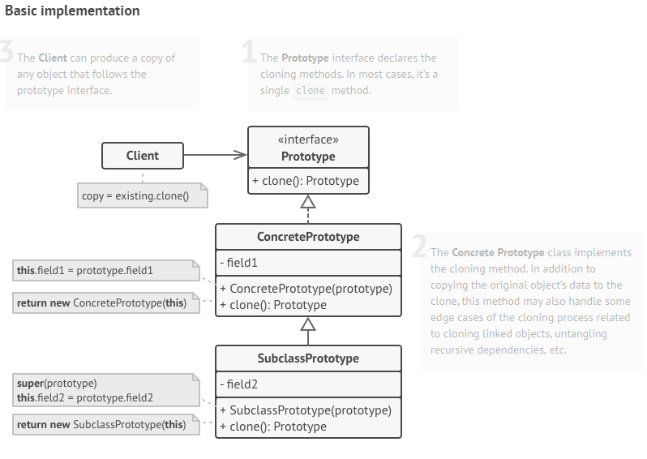

.. include::  ../global.rst
   :start-after: [ProgrammingLinksSectionStart]
   :end-before:  [ProgrammingLinksSectionEnd]

######################################################
Design Patterns
######################################################

.. contents::
   :depth: 4
   :local:

**********************************
Creational Design Patterns
**********************************

* https://refactoring.guru/design-patterns/creational-patterns 

Creational design patterns provide various object creation mechanisms, which increase flexibility 
and reuse of existing code.

Different type of creational design patterns

#. Factory Method
#. Abstract Factory
#. Prototype
#. Builder
#. Singleton

Factory Pattern/Factory Method
=================================

Links

* |ClassFactoryPattern|

Factory Method is a creational design pattern that provides an interface for 
creating objects in a superclass, but allows subclasses to alter the type of 
objects that will be created.

Class factory pattern is an object/method for creating other objects. Basically, we have some class 
or function that creates and returns a new object based on whatever data is provided. 
Factory pattern is a basic design principle in OOP, as an abstraction of a constructor of a class. 
The class factory creates and returns new objects by instantiating various classes 
(through the use of constructors). In most cases, a class factory has at most one method/function 
that is given some type of incoming data, and returns a new object (or pointer) to what was created.

The Factory Method pattern suggests that you replace direct object construction calls 
(using the ``new`` operator) with calls to a special `factory` method(client call factory method. Ex] buildCar()). 
Don't worry: the objects are still created via the new operator, 
but it's being called from within the factory method. Objects returned by a factory method are 
often referred to as `products`.

The Factory design pattern is a way to create the object at runtime instead of at compile time.
When we use use ``new`` to create object we are creating it at compile type, however by delegating
that task to the factory to create the object using the ``new`` operator.

* **To force this design pattern, make all product constructor protected or private.** (source: youtube video)

   * we create object without exposing logic to the client. The client doesn't have to know the details
     of the constructor

.. drawio-image:: ./_images/PP_0002_OOP_ConceptsAndDesign.drawio
   :page-index: 0

In the case of the car dealership, we can pass in the data we're given into a class factory that 
will create new cars such as returning a new ``LuxuryCar()``, or returning a new ``SportCar()``. 
We return a pointer of type Car, this works because all these derived classes inherit from the 
abstract base class

.. drawio-image:: ./_images/PP_0002_OOP_ConceptsAndDesign.drawio
   :page-index: 1

More example diagram of Factory Pattern Design

.. list-table:: Genral Structure and Implementation Structure Of Factory Design Pattern
   :header-rows: 1
   :class: my-class
   :name: my-name

   * - Structure
     - Example of Implementation

   * - The structure
       
       .. image:: ./_images/PP-0003_RefactorGuru_FactoryPatternStructure.PNG

     - Real example
       
       .. image:: ./_images/PP-0003_RefactorGuru_FactoryPatternConcreteExample.PNG

Design Pattern- Abstract Factory
==================================

Design Pattern- Prototype Design Pattern
==========================================

Basic Prototype
-----------------

Prototype Registry Implementation
-----------------------------------

.. drawio-image:: ./_images/PP_0002_OOP_ConceptsAndDesign.drawio
   :page-index: 2

.. list-table:: Prototype Registry Structure vs Concrete Implementation
   :header-rows: 1
   :class: my-class
   :name: my-name

   * - Structure
     - Example of Implementation

   * - The structure
       
       .. image:: ./_images/PP-0003_RefactorGuru_PrototypeRegistryStructure.PNG

     - Real example
       
       .. image:: ./_images/PP-0003_RefactorGuru_PrototypeDesignPattern_ConcreteStructure.PNG
